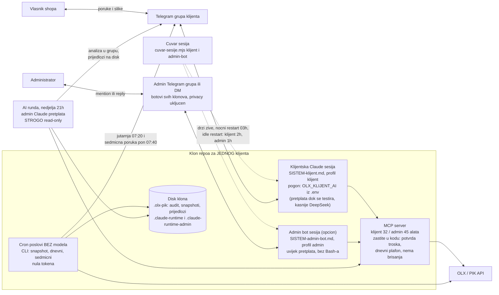
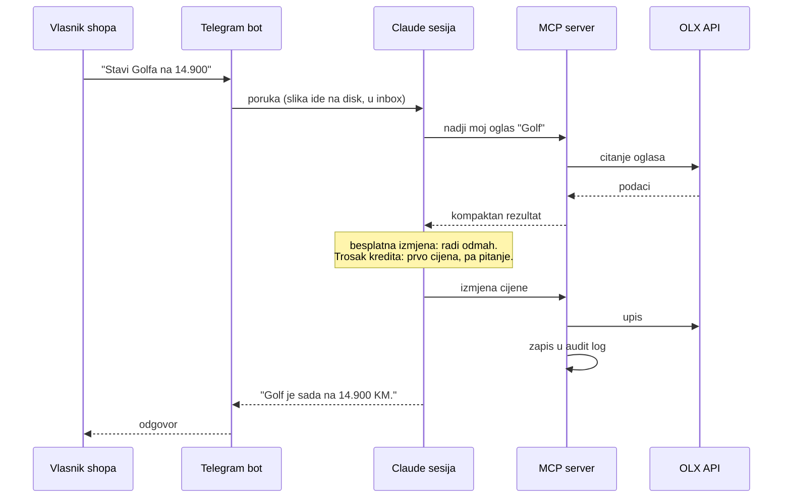
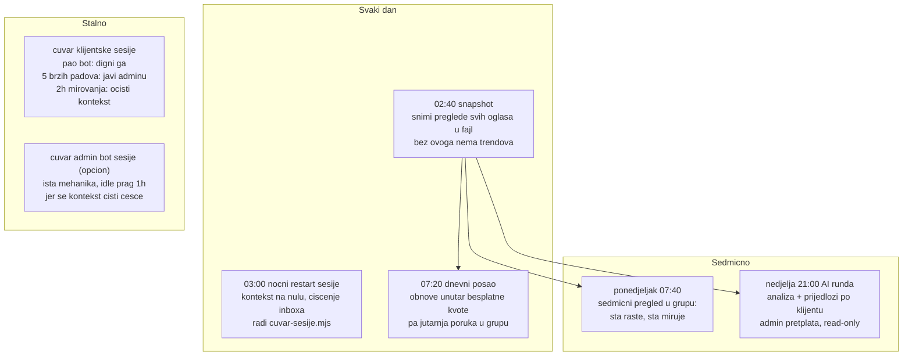
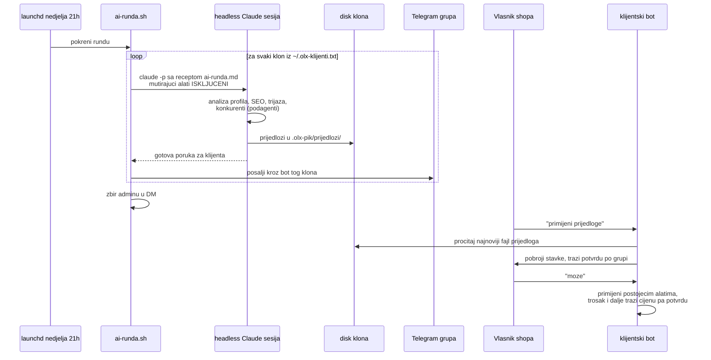

# Arhitektura sistema

Mapa cijelog sistema na jednom mjestu: sta postoji, ko s kim prica, sta radi samo a sta se
pokrece rucno. Dijagrami su mermaid, render ih GitHub, Claude i vecina editora.

Kljucna ideja sistema u jednoj recenici: **sve sto se moze izracunati radi kod bez AI-ja i
kosta nula tokena; AI se poziva samo tamo gdje treba razumijevanje ili prosudba.**

## 1. Velika slika

Jedan klon repoa po klijentu, sve na admin masini. Po klonu DVIJE stalne sesije (klijentska i
admin bot), plus cron poslovi bez modela i sedmicna AI runda.

Granice pogona:

- Klijentsku sesiju pogoni ono sto kaze `OLX_KLIJENT_AI` u `.env` klona: `pretplata` dok prvih
  klijenata testira, kasnije `deepseek` (bez popunjenih OLX_DEEPSEEK_* varijabli sesija se ne
  pokrece). Nista se ne konfigurise globalno po masini, sve je u repou i `.env`.
- Admin bot i AI runda su iskljucivo vlasnikov kanal i uvijek idu na pretplatu. Klijent sa
  pretplatom nikad ne razgovara direktno.
- Admin botovi vise klonova zive u jednoj admin grupi: privacy u BotFatheru im OSTAJE ukljucen,
  pa svaki prima samo poruke u kojima je oznacen i odgovore na svoje poruke. Kontekst botova se
  ne mijesa, a reply radi kao obracanje.

## 2. Sta se desava kad klijent posalje poruku

Za trosak kredita (izdvajanje, akcija, naplatna objava) alat u kodu ODBIJA izvrsenje bez
`confirm`; prompt trazi da se klijentu prvo kaze cijena. Dvije nezavisne brane.

## 3. Automatski poslovi: ko, kad i sta

Nista od ovoga ne poziva model osim AI runde. Termini su razmaknuti namjerno.

Zakazivanje: macOS launchd (instalira `scripts/instaliraj-cron.sh`, po klonu), Windows Task
Scheduler (`deploy/windows/instaliraj-zadatke.ps1`). AI runda je izuzetak: jedan globalni posao
na admin masini (`deploy/launchd/ba.codefactory.olx.ADMIN.ai-runda.plist`, instalira se rucno
jednom), jer sama obilazi sve klonove.

## 4. AI runda i primjena prijedloga

Ako runda naleti na limit pretplate, prekida se odmah i javlja adminu, da ostali klijenti ne
dobiju polovicne analize.

## 5. Sta je automatski, a sta rucno

| Automatski, ne diras | Rucno, admin |
| --- | --- |
| dnevne obnove i jutarnja poruka | onboarding novog klijenta (lista ispod) |
| nocni snapshot pregleda | `azuriraj-sve.sh` kad izadje nova verzija |
| sedmicni pregled ponedjeljkom | `ai-runda.sh` dok se ne instalira plist |
| cuvari obje sesije: padovi, restarti, inbox | `provjeri-prompt.sh` poslije izmjene promptova |
| AI runda kad se plist instalira | serijski poslovi po zelji (SEO prolaz, ciscenje) |
| audit log svake izmjene i troska | pravo brisanje oglasa (`listings rm`) |
| admin bot: nadzor i rad preko Telegrama | priprema admin runtime-a (jednom po klonu) |
| biljezenje tokena u transkriptima sesija | `npm run tokeni -- --upisi` sedmicno (trajni dnevnik) |

## 6. Onboarding novog klijenta (rucni koraci, redom)

**Izvrsna verzija ove liste je skill `olx-novi-klijent`**: otvori Claude Code i reci
"postavi novog klijenta", sesija vodi kroz sve korake i sama izvrsava sto moze. Lista ispod
je referenca istog redoslijeda. Na kraju UVIJEK `node scripts/provjeri-klon.mjs`: dok ijedna
stavka FALI, sa klijentom se ne pocinje.

1. Kloniraj repo u novi folder (jedan klon = jedan nalog), pa `git checkout --detach stabilno`.
2. `.env`: `OLX_TOKEN`, `OLX_MCP_PROFILE=klijent`, `OLX_MAX_SPEND_PER_DAY`, Telegram varijable.
3. BotFather: novi bot, pa `/setprivacy` na Disable.
4. `scripts/pripremi-runtime.sh <bot_token> <id_grupe> <telegram_id>` — pravi izolovani
   runtime (svoj bot, svoj allowlist, bez globalnih servera).
5. `npm ci && npm run build && npm test`.
6. `scripts/instaliraj-cron.sh` (macOS) ili `deploy/windows/instaliraj-zadatke.ps1` (Windows):
   instalira sva 4 posla, ukljucujuci cuvara koji odmah digne sesiju.
7. Dodaj putanju klona u `~/.olx-klijenti.txt` (azuriranja i AI runda).
8. Test iz grupe: pitanje, objava sa slikom, i jedan trosak da se vidi tok potvrde.
9. Opcion, admin bot: novi bot u BotFatheru (privacy NE dirati, ostaje ukljucen), pa
   `node scripts/pripremi-admin-runtime.mjs <bot_token> <tvoj_id> [id_admin_grupe]`, pa ponovo
   instalater poslova iz koraka 6. Na Windowsu jos i jedan `claude login` sa
   `CLAUDE_CONFIG_DIR=.claude-runtime-admin` (na macOS-u ne treba, pretplata je u Keychainu).
