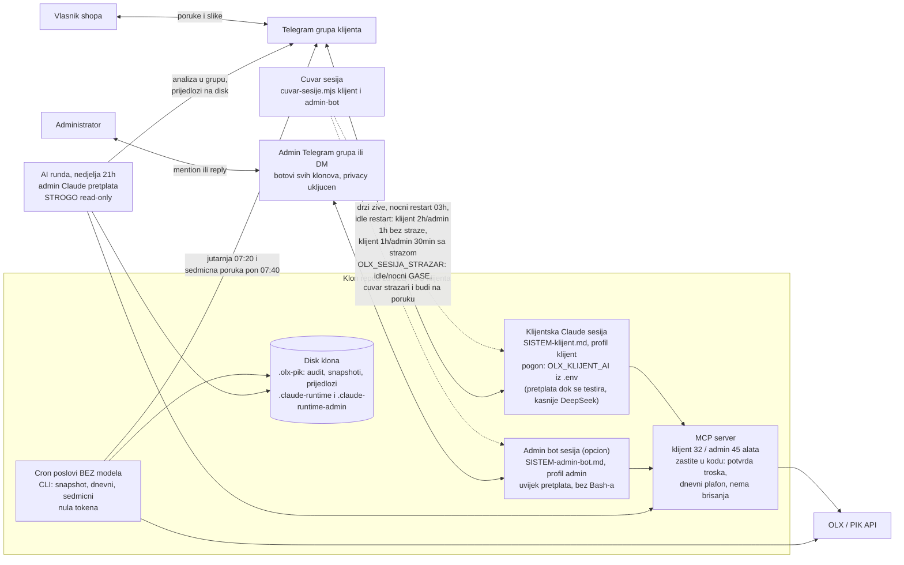
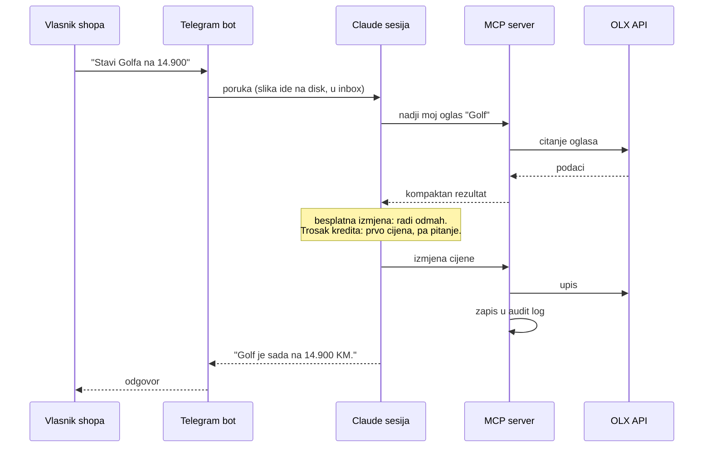
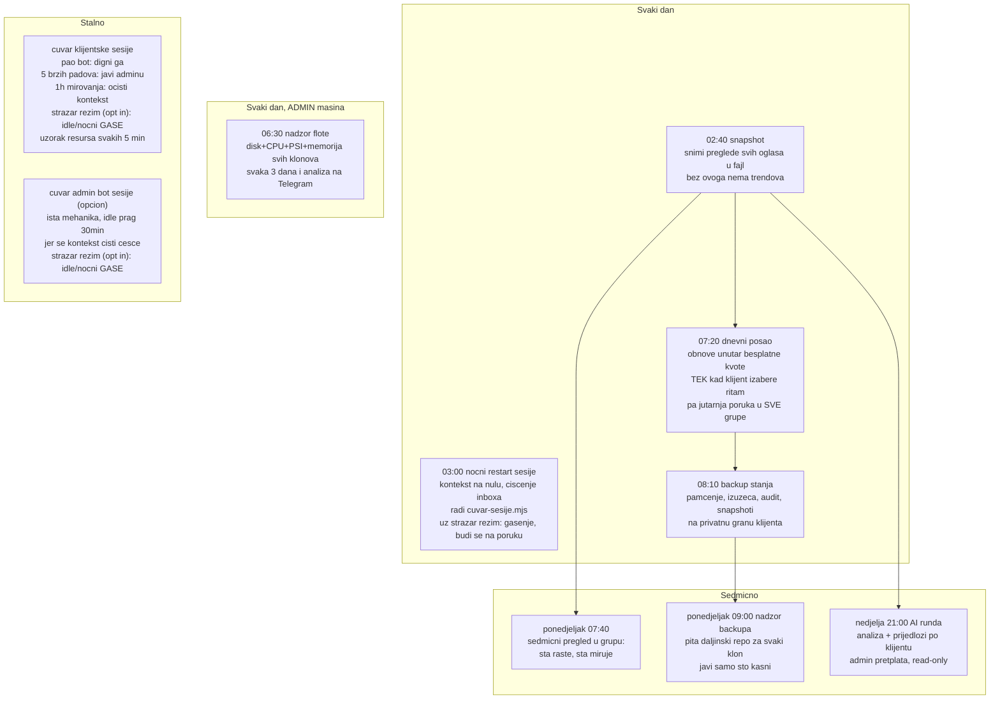
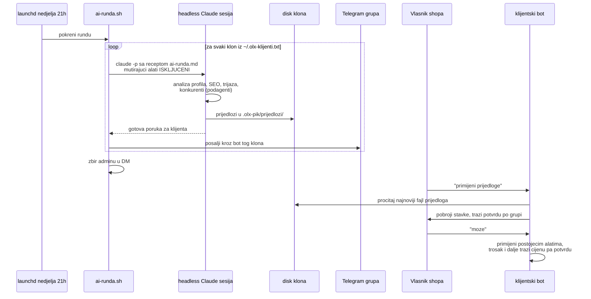
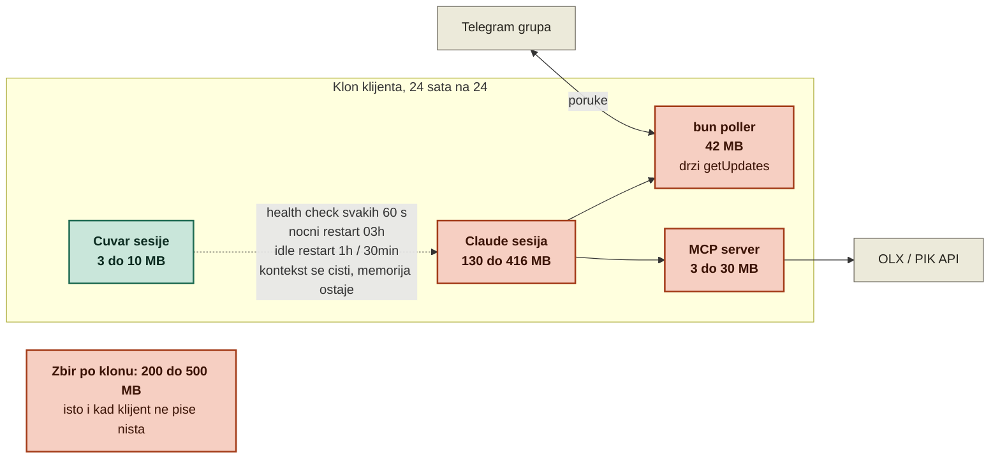
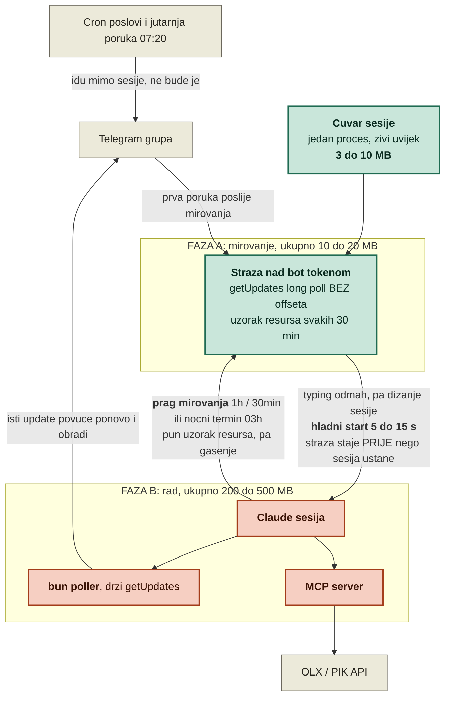
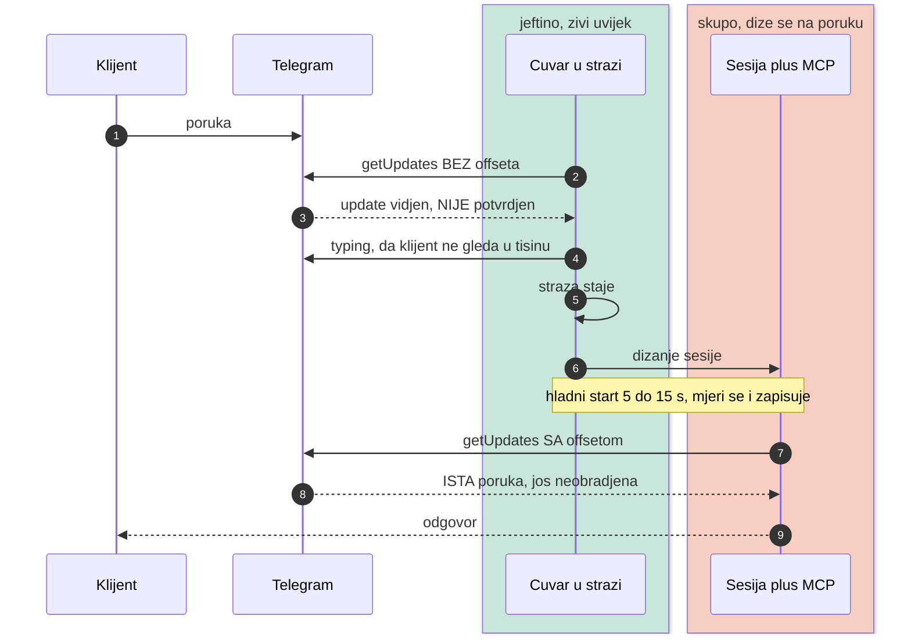
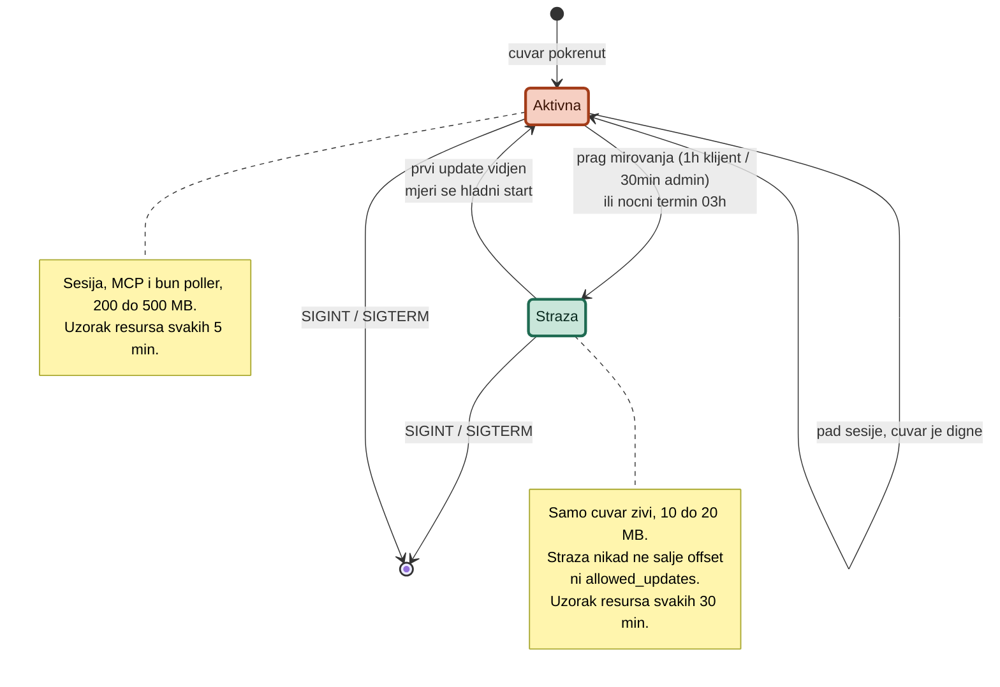
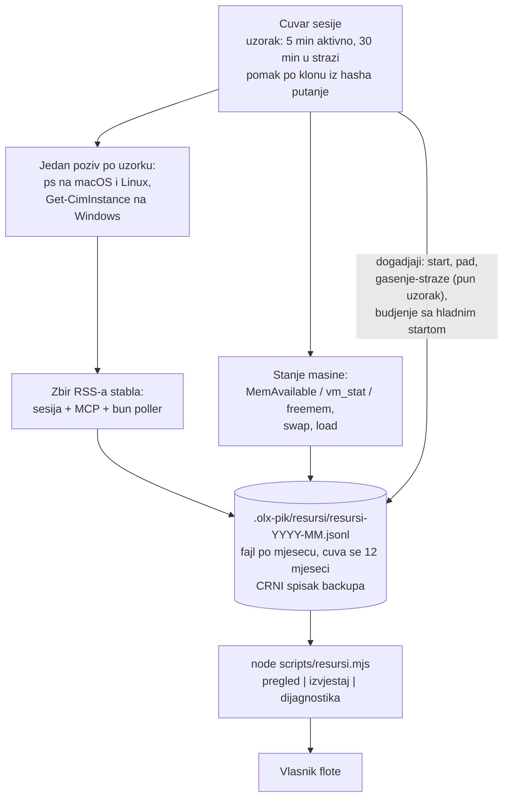

# Arhitektura sistema

Mapa cijelog sistema na jednom mjestu: sta postoji, ko s kim prica, sta radi samo a sta se
pokrece rucno. Dijagrami su mermaid, render ih GitHub, Claude i vecina editora.

Kljucna ideja sistema u jednoj recenici: **sve sto se moze izracunati radi kod bez AI-ja i
kosta nula tokena; AI se poziva samo tamo gdje treba razumijevanje ili prosudba.**

## 1. Velika slika

Jedan klon repoa po klijentu, sve na admin masini. Po klonu DVIJE stalne sesije (klijentska i
admin bot), plus cron poslovi bez modela i sedmicna AI runda.



Prompt sesije se SASTAVLJA pri svakom pokretanju (`scripts/sastavi-prompt.mjs`): pravila
razgovora, pa javni profil klijenta (`KLIJENT-javno.md`), pa pamcenje koje je bot sam zapisao
(`.olx-pik/pamcenje.json`, alat `olx_zapamti`). Razlog je tehnicki:
`--append-system-prompt-file` nije aditivan, sa dva fajla vazi samo zadnji. Posljedica je da
sistem raste uz klijenta: sesija se resetuje svaku noc, a pamcenje se tada ponovo ubaci u prompt,
pa bot od prve poruke zna ton, footer i navike bez ijednog poziva alata. `KLIJENT.md` u tome NE
ucestvuje: on nosi tokene i komercijalni dogovor i ostaje zabranjen klijentskoj sesiji.

Skidanje artikala: kad artikla nema na stanju, bot ga na zahtjev arhivira
(`.olx-pik/arhiva-artikala/<id>/`, opis oglasa + originalne slike kao bajtovi) pa sakrije
(`olx_skini_artikal`). Povratak (`olx_vrati_artikal`) skriven oglas samo otkrije; kad oglasa
vise nema, objavi novi iz arhive sa originalnim slikama i prenese izuzece na novi broj. Arhiva
ide u backup (jedini primjerak slika kad oglas nestane) i raste samo eksplicitnom odlukom
klijenta.

Granice pogona:

- Klijentsku sesiju pogoni ono sto kaze `OLX_KLIJENT_AI` u `.env` klona: `pretplata` dok prvih
  klijenata testira, kasnije `deepseek` (bez popunjenih OLX_DEEPSEEK_* varijabli sesija se ne
  pokrece). Nista se ne konfigurise globalno po masini, sve je u repou i `.env`.
- Admin bot i AI runda su iskljucivo vlasnikov kanal i uvijek idu na pretplatu. Klijent sa
  pretplatom nikad ne razgovara direktno.
- Admin botovi vise klonova zive u jednoj admin grupi: privacy u BotFatheru im OSTAJE ukljucen,
  pa svaki prima samo poruke u kojima je oznacen i odgovore na svoje poruke. Kontekst botova se
  ne mijesa, a reply radi kao obracanje.

## 2. Sta se desava kad klijent posalje poruku



Za trosak kredita (izdvajanje, akcija, naplatna objava) alat u kodu ODBIJA izvrsenje bez
`confirm`; prompt trazi da se klijentu prvo kaze cijena. Dvije nezavisne brane.

## 3. Automatski poslovi: ko, kad i sta

Nista od ovoga ne poziva model osim AI runde. Termini su razmaknuti namjerno.



Zakazivanje: macOS launchd (instalira `scripts/instaliraj-cron.sh`, po klonu), Windows Task
Scheduler (`deploy/windows/instaliraj-zadatke.ps1`). Tri posla su izuzetak i zive globalno na
admin masini, jer sami obilaze sve klonove iz `~/.olx-klijenti.txt`: AI runda
(`ADMIN.ai-runda.plist`), nadzor backupa (`ADMIN.backup-nadzor.plist`) i nadzor flote
(`ADMIN.nadzor-flote.plist`, jedini od ova tri koji se pokrece SVAKI DAN, ne sedmicno, jer dnevna
kolekcija CPU/disk/PSI mora ostati gusta), sva tri se instaliraju rucno jednom.

Backup je jedini posao koji je uslovan: instalira se samo kad je `OLX_STANJE_REPO` popunjen u
`.env`. Bez toga bi svako jutro pao i slao alarm, a klon bi imao jedan pokvaren zadatak vise.

Automatske obnove NISU ukljucene same od sebe (odluka vlasnika 04.08.2026): dok klijent ne kaze
svoj ritam, dnevni posao ne obnavlja nista, a prva jutarnja poruka ga pita kako zeli (sa brojem i
listom danas dostupnih oglasa, narednih dana samo podsjetnik u jednoj liniji). Njegov odgovor bot
zapise kao ritam (`.olx-pik/ritam-obnova.json`, ukljucujuci i "iskljuceno"), a pojedinacne
artikle sklanja lista izuzetaka (`.olx-pik/izuzeca.json`).

Kome idu izvjestaji: svakoj grupi pod `groups` u `.claude-runtime/channels/telegram/access.json`,
plus `TELEGRAM_CHAT_ID` iz `.env` kao dopuni, dedupirano. Isti fajl odlucuje i od koga bot PRIMA
poruke, pa se spisak ne vodi dvaput. Bot API nema poziv koji vraca u kojim je bot grupama, a
`my_chat_member` je nedostupan jer polling drzi Telegram plugin ziva sesija, pa se id nove grupe
ocita rucno jednom. Sedmicni posao usput radi `getChat` nad svakim odredistem i javi ADMINU kad
je bot iz neke grupe izbacen; sam ne uklanja nista, jer prelazak grupe u supergrupu mijenja id.

## 4. AI runda i primjena prijedloga



Ako runda naleti na limit pretplate, prekida se odmah i javlja adminu, da ostali klijenti ne
dobiju polovicne analize.

## 5. Sta je automatski, a sta rucno

| Automatski, ne diras | Rucno, admin |
| --- | --- |
| dnevne obnove i jutarnja poruka | onboarding novog klijenta (lista ispod) |
| nocni snapshot pregleda | `azuriraj-sve.sh` / `deploy\windows\azuriraj.ps1` kad izadje nova verzija |
| sedmicni pregled ponedjeljkom | `ai-runda.sh` dok se ne instalira plist |
| cuvari obje sesije: padovi, restarti, inbox | `provjeri-prompt.sh` poslije izmjene promptova |
| AI runda kad se plist instalira | serijski poslovi po zelji (SEO prolaz, ciscenje) |
| audit log svake izmjene i troska (nosi i verziju) | pravo brisanje oglasa (`listings rm`) |
| prijava da klon zaostaje za izdanjem (hook pri startu sesije) | izdanje i pustanje u flotu (`izdanje.mjs`, skill `olx-izdanje`) |
| admin bot: nadzor i rad preko Telegrama | priprema admin runtime-a (jednom po klonu) |
| cuvar drzi sesiju zivom (pad, nocni i idle restart; strazar rezim opt in po klonu, prvo admin bot) | rucna proba sesije u prvom planu: `node scripts/pokreni-klijenta.mjs` (prije nje ugasiti cuvara) |
| biljezenje tokena u transkriptima sesija | `npm run tokeni -- --upisi` sedmicno (trajni dnevnik) |

## 6. Onboarding novog klijenta (rucni koraci, redom)

**Izvrsna verzija ove liste je skill `olx-novi-klijent`**: otvori Claude Code i reci
"postavi novog klijenta", sesija vodi kroz sve korake i sama izvrsava sto moze. Lista ispod
je referenca istog redoslijeda. Na kraju UVIJEK `node scripts/provjeri-klon.mjs`: dok ijedna
stavka FALI, sa klijentom se ne pocinje.

1. Kloniraj repo u novi folder (jedan klon = jedan nalog), pa `git checkout --detach stabilno`.
2. `.env`: `OLX_TOKEN`, `OLX_MCP_PROFILE=klijent`, `OLX_MAX_SPEND_PER_DAY`, Telegram varijable,
   pa `OLX_KLIJENT` i `OLX_STANJE_REPO` za backup stanja (bez njih klijentovo pamcenje, izuzeca i
   snapshoti postoje samo na disku te masine).
3. Build: `npm ci`, pa `npm run build`, pa `npm test` (tri poteza; PowerShell 5.1 nema `&&`).
4. BotFather: novi bot, pa `/setprivacy` na Disable.
5. `node scripts/pripremi-runtime.mjs <bot_token> <id_grupe> <telegram_id>` — pravi izolovani
   runtime (svoj bot, svoj allowlist, bez globalnih servera). Ta skripta radi SAMO jednom, na
   praznom klonu: svaku sljedecu grupu dodaje `telegram grupe dodaj <id>`, jer bi brisanje
   runtimea radi ponovne pripreme pobrisalo sva uparivanja.
5b. Telegram plugin U TAJ runtime, jer plugin cache ide po `CLAUDE_CONFIG_DIR`. Pripremi
   skripta ga instalira SAMA na kraju pripreme; provjeri njen izlaz. Ako je instalacija pala
   (SSH kljuc, mreza), rucno:
   `CLAUDE_CONFIG_DIR=.claude-runtime claude plugin marketplace add anthropics/claude-plugins-official`
   pa `... claude plugin install telegram@claude-plugins-official` (PowerShell:
   `$env:CLAUDE_CONFIG_DIR=".claude-runtime"; claude plugin marketplace add ...; claude plugin install ...`).
   Uz to `bun` u PATH-u, jer plugin njime dize svoj MCP server. Bez oba bot ne odgovara na
   poruke, ali izvjestaji stizu, pa se kvar previdi.
5c. Windows, sesija na pretplati: jednom po runtime-u `$env:CLAUDE_CONFIG_DIR=".claude-runtime"`
   pa `claude login`, i to PRIJE instalacije poslova (kredencijali zive u config diru; na
   DeepSeeku ne treba, na macOS-u je pretplata u Keychainu).
6. Prva proba sesije: `node scripts/pokreni-klijenta.mjs` u istom terminalu, na obje platforme.
   Greska (login, plugin, bun, token) se vidi odmah u prvom planu. Ugasi sa Ctrl+C prije
   sljedeceg koraka: cuvar odmah digne svoju sesiju, a dvije sesije na istom bot tokenu se
   sudaraju na Telegramu.
7. `scripts/instaliraj-cron.sh` (macOS) ili
   `powershell -ExecutionPolicy Bypass -File deploy/windows/instaliraj-zadatke.ps1` (Windows):
   instalira poslove, ukljucujuci cuvara koji odmah digne sesiju, i backup kad je podesen.
8. Dodaj putanju klona u `~/.olx-klijenti.txt` NA MASINI GDJE KLON ZIVI (azuriranja i AI runda).
9. Test iz grupe: pitanje, objava sa slikom, i jedan trosak da se vidi tok potvrde.
10. Opcion, admin bot: novi bot u BotFatheru (privacy NE dirati, ostaje ukljucen), pa
   `node scripts/pripremi-admin-runtime.mjs <bot_token> <tvoj_id> [id_admin_grupe]`, pa ponovo
   instalater poslova iz koraka 7. Na Windowsu jos i jedan `claude login` sa
   `$env:CLAUDE_CONFIG_DIR=".claude-runtime-admin"` (na macOS-u ne treba, pretplata je u
   Keychainu).

## 7. Kako nova verzija dolazi do klijenata

Klijentski klonovi NE prate granu. Oni stoje na tagu `stabilno`, u detached stanju. To je
kapija: los commit fizicki ne moze doci do klijenta dok ga administrator ne propusti.

Dva taga rade zajedno i imaju razlicite poslove:

- **`vX.Y.Z`** je nepomican dokaz sta je izdanje. Anotiran tag, nikad se ne pomjera. Bez njega
  vracanje na prethodnu verziju nema cilj, jer pomjeren `stabilno` vise nigdje ne postoji.
- **`stabilno`** je prekidac koji kaze koje izdanje flota vozi. Lightweight tag, pomjera se.

```
rad na main  ->  test na svom klonu  ->  npm version  ->  tag vX.Y.Z  ->  stabilno  ->  azuriraj
```

1. Rad ide na `main`. Feature grana se spoji u `main` kad je gotova.
2. Na svom klonu: `npm test`, `npm run typecheck`, `scripts/provjeri-prompt.sh`. Tag se ne
   pomjera na neprovjereno stanje.
3. `npm version <broj>`: hook `preversion` sam vrti `npm test`, pa se broj podigne u
   `package.json` i `package-lock.json`, hook `version` prepise `src/core/verzija.ts` kroz
   `scripts/upisi-verziju.mjs`, i npm napravi commit i anotiran tag `vX.Y.Z`. Prije toga upisi
   sekciju u `CHANGELOG.md`: test pada ako izdanje nema zapis.
4. `node scripts/pusti-u-flotu.mjs` gura commit i tagove na remote i tu STANE. Do ove tacke je sve
   povratno.
5. Nepovratni dio, iza eksplicitne zastavice: `node scripts/pusti-u-flotu.mjs --pomjeri-stabilno`
   pomjeri prekidac na izdanje i sam pokrene azuriranje flote. Prekidac ide zadnji namjerno:
   `stabilno` je jedini ref koji flota prati, pa se pomjera samo kad je sve ostalo vec na remoteu.
   **Pokrece se na masini gdje klonovi zive**, jer restartuje njihove poslove: klonovi na Windowsu
   se ne mogu azurirati sa macOS-a ni obrnuto.

Cijeli tok od "posao je gotov" do "flota vozi novo", ukljucujuci changelog i evidenciju, vodi skill
`olx-izdanje`. Rucne komande ispod su ono sto on izvrsava, ne alternativa njemu.

| Masina | Komanda | Prikaz bez izmjene |
| --- | --- | --- |
| macOS, Linux | `scripts/azuriraj-sve.sh` | `scripts/azuriraj-sve.sh --suho` |
| Windows | `powershell -ExecutionPolicy Bypass -File deploy\windows\azuriraj.ps1` | isto uz `-Suho` |
| jedan klon, iz njega samog | `node scripts/azuriraj-ovaj-klon.mjs [--restart]` | isto uz `--suho` |

Verzija ne mora biti napravljena rucno: `node scripts/izdanje.mjs <broj>` odbija izdanje koje bi
bilo polovicno (pogresna grana, prljava kopija, klon iza remotea, zauzet tag, nedostajuca sekcija u
`CHANGELOG.md`), pa pusti `npm version` da vrti testove i tagira. Skill: `olx-izdanje`.

Klon ne prati nista sam, pa ne zna kad se prekidac pomjeri. To rjesava `SessionStart` hook
(`provjeri-izdanje.mjs --samo-zaostajanje`): pri pokretanju sesije javi da klon zaostaje i da
komandu, ali NIKAD ne povlaci sam. Dva razloga: zamjena koda ispod zive sesije ostavlja MCP server
na starom buildu, a automatsko povlacenje u 03:00 zaobilazi kapiju i moze ostaviti klijenta bez
bota. U klijentskoj bot sesiji je hook tih, jer bi mu izlaz usao u kontekst bota.

`azuriraj-ovaj-klon.mjs` ima jednu razliku prema flotnim skriptama koja je namjerna: kad build ili
testovi padnu, klon se VRACA na izdanje sa kojeg je krenuo i ponovo se izgradi. Flotne skripte tu
ostavljaju checkout, pa klon zavrsi sa novim `src` i starim `dist`. Vrijedi ih na to poravnati kad
se budu dirale.

Oba rade isto, po klonu iz `~/.olx-klijenti.txt`: fetch tagova **sa `--force`**, checkout
`stabilno`, `npm ci`, build, testovi, pa restart samo DUGOZIVIH poslova (`sesija`, `admin-bot`).
Na kraju prijavljuju i na kojem je izdanju flota (`git describe --tags`), pa razilazenje izdanja
medju klonovima ne moze proci neopazeno.

`--force` nije kozmetika: `git fetch --tags` bez njega ODBIJA pomjeriti tag koji lokalno vec
postoji ("would clobber existing tag"), pa je klon ostajao na starom commitu dok checkout, build i
testovi prodju i skripta prijavi uspjeh. Tiho neazuriranje flote je najgori ishod te skripte
(izmjereno 30.07.2026, popravljeno u 0.4.0).

Tri pravila koja su u obje skripte i nisu slucajna:

- **Klon sa lokalnim izmjenama se preskace.** Neko je rucno nesto mijenjao; pregaziti to je gore
  od neazuriranog klona.
- **Kad build ili testovi padnu, zadaci tog klona se NE diraju.** Klijent na staroj radnoj
  verziji je bolji od klijenta na polovicno azuriranoj.
- **Kalendarski poslovi (snapshot, dnevno, sedmicno) se ne restartuju.** Njihov "restart" bi ih
  IZVRSIO odmah, pa bi klijent dobio jutarnji izvjestaj usred dana i potrosila bi se dnevna
  runda obnova van reda. Oni novi kod uzmu sami na sljedecem terminu, jer su jednokratni node
  procesi. Restart treba samo sesijama, jer one jedine drze stari kod i stari prompt u memoriji.

Vracanje na prethodnu verziju je pomjeranje prekidaca na prethodno izdanje pa ponovo azuriranje, i
to je jedan potez:

```
node scripts/pusti-u-flotu.mjs --izdanje v0.3.0 --pomjeri-stabilno
```

Samo pomjeranje taga ne mijenja nista ni na jednoj masini, jer nema posla koji automatski povlaci.
Sta je bilo prethodno izdanje procitaj iz `CHANGELOG.md` ili `git tag -l "v*"`.

Jedan rub koji vrijedi znati: azuriranje preskace klon sa lokalnim izmjenama, pa i vracanje moze
tiho ostaviti jedan klon na losoj verziji. Na kojem je izdanju koji klon vidi se u zbiru
azuriranja i u `node scripts/provjeri-klon.mjs` (prva stavka).

## 8. Gdje zivi klijentsko stanje i kako se spasava

Kod i stanje se NIKAD ne mijesaju. To su dva odvojena repoa i dva odvojena toka:

```
kod:     mob-dev-org/olx-mcp-api   tag stabilno -> vX.Y.Z   ->  svi klonovi, ista verzija
stanje:  <org>/olx-stanje          grana po klijentu  <-  svaki klon salje svoje
```

**Zasto stanje ne moze u repo koda**, iako grana po klijentu na prvi pogled zvuci uredno:

- `azuriraj-sve.sh` preskace klon koji ima lokalne izmjene. Svaki upis pamcenja bio bi lokalna
  izmjena, pa se nijedan klon vise nikad ne bi azurirao.
- Azuriranje radi `git checkout --detach stabilno`. Fajlovi koji postoje na klijentskoj grani a
  ne u tagu bi se pri tome obrisali iz radnog foldera, dakle pamcenje bi nestajalo pri svakom
  azuriranju.
- Danas svi klijenti rade bit za bit isti kod, pa jedan prolaz testova pokriva flotu. Grana po
  klijentu u repou koda bi to ukinula.

**Zasto grana po klijentu u repou stanja jeste ispravna:** na jedan ref pise samo jedna masina,
pa je push uvijek fast forward i spajanja nema. Folder po klijentu na jednoj grani bi znacio da
svaki klon svaki dan pise na isti ref, dakle pull i rebase petlja u automatskom poslu.

Tri pravila koja backup nikad ne krsi:

- **Bijeli spisak, ne crni.** Salje se samo ono sto je izricito navedeno. Crni spisak bi tiho
  objavio svaki novi fajl koji neko kasnije doda. Sto nije ni na jednom spisku, prijavi se adminu
  kao nepoznato, pa spisak ne moze ostati ustajao a da se to ne primijeti.
- **Nikad force, nikad merge, nikad rebase.** Na razilazenje stanje ide na granu
  `<grana>-sudar-<masina>-<datum>` i javi se adminu. Prije toga se dvije masine na istoj grani
  zaustave preko `MASINA.json`, jos prije ijednog commita.
- **Nijedan token ne izlazi.** Uz bijeli spisak radi i provjera sadrzaja: fajl u kojem se nadje
  oblik tokena se ne salje nego se prijavi. Bijeli spisak stiti od novih fajlova, ali ne od
  sadrzaja, a `saznanja.jsonl` i prijedloge pise model.

Backup nikad ne brise iz kopije ono cega vise nema u klonu. Nestanak fajla je ili uredno ciscenje
ili nesreca, a backup koji prati nesrecu nije backup.

Oporavak na novoj masini: `.claude/skills/olx-novi-klijent/references/oporavak.md`. Vazno je da
backup vraca PODATKE, ne radni klon: tokeni se unose rucno, i to je namjerno.

## 9. Otisak resursa: stalna sesija naspram strazara

Ovo je jedina razlika u arhitekturi koju nosi grana `arhitektura-manji-resursi`. Sve ostalo iz
sekcija 1 do 8 ostaje netaknuto: isti klon po klijentu, isti MCP, isti cron poslovi, isti backup.

Iscrtana verzija ovih dijagrama, sa trakovima potrosnje i vremenskom trakom dana:
<https://claude.ai/code/artifact/741fa916-9b97-4308-956d-eb5309bdf112>. Izvor stranice je u repou
(`olx-dokumentacija/radne-biljeske/strazar-telemetrija-stranica.html`), pa se moze ponovo objaviti
ako link istekne.

### 9.1 Danasnje stanje (default, i dalje vazi bez prekidaca)

Sesija je STALNO dignuta. Cuvar je samo cuva: pao bot digne ga, na nocni termin i na prag mirovanja
je restartuje da ocisti kontekst. Memorija se drzi cijeli dan, bez obzira da li klijent pise.

Crveno trosi memoriju stalno, zeleno je jeftino i samo ceka na mrezi.



Posljedica za flotu: deset klijenata na jednoj masini znaci deset takvih zbirova stalno, jer
mirovanje ne mijenja nista.

### 9.2 Strazar rezim, ova grana (iza `OLX_SESIJA_STRAZAR`, opt in po klonu)

Na isti prag mirovanja i isti nocni termin cuvar sesiju GASI umjesto da je restartuje, pa sam
preuzme Telegram strazu. Kad poruka stigne, digne sesiju i pusti plugin da poruku obradi.



Zasto poruka ne moze propasti dok sesija ustaje:



Zivotni ciklus sesije, isti crtez kao stanje u kodu:



Zasto strazu drzi cuvar a ne novi Bun proces: offset je potvrda, a potvrdjena poruka je pojedena
poruka. Straza smije samo GLEDATI. Uz to, dva `getUpdates` konzumera na istom tokenu daju 409, pa
straza mora prestati prije nego sesija ustane; oboje je lakse garantovati u procesu koji sesiju i
gasi i dize.

### 9.3 Telemetrija resursa (ista grana)

Mjeri isti cuvar, jer se ionako budi svakih 60 s i jedini zna PID sesije koju je sam pokrenuo.
Nema novog zakazanog posla ni novog deploy fajla.



Dvije stvari koje se pri citanju brojeva lako promase:

- **Vrijeme u strazi se racuna iz parova `gasenje-straze` i `budjenje`**, ne iz udjela uzoraka. Kad
  interval nije konstantan (5 min aktivno, 30 min u strazi), udio uzoraka daje sistematski pogresan
  broj, a to je bas broj zbog kojeg se telemetrija i gleda. Udio uzoraka ostaje samo rezerva kad par
  nije zatvoren.
- **Zbir RSS-a je gornja granica**, jer duplo broji dijeljene biblioteke. Da li je masini tesko kazu
  slobodna memorija i swap, pa savjeti u izvjestaju ne prijavljuju curenje na osnovu samog rasta
  RSS-a.

Detalji odluka i stanje rada: `olx-dokumentacija/radne-biljeske/telemetrija-resursa.md` i
`olx-dokumentacija/radne-biljeske/strazar-rezim-razrada.md`.

### 9.4 CPU po klonu i flotni nadzor (ista grana)

`SHEMA_VERZIJA 2` u `scripts/lib/resursi.mjs` dodaje `cpu_klona_pct`: CPU% stabla procesa jednog
klona (sesija + MCP + bun poller), racunat preko `scripts/lib/cpu.mjs`. Isto obrazlozenje kao za
9.2: racuna se iz DELTE kumulativnog CPU vremena izmedju dva mjerenja, nikad iz trenutnog `%cpu`
iz `ps`, jer bi sesija koja satima miruje pa naglo pocne raditi sa trenutnim `%cpu` i dalje
pokazivala nisko zauzece satima poslije budjenja (razvuceno na sve satove mirovanja) umjesto
odgovora na pitanje "ko jede procesor UPRAVO SADA". Stariji redovi (sema 1) nemaju ovo polje;
tretira se kao `null` ("klon jos nije nadogradjen"), nikad kao `0`.

Flotni posao `scripts/nadzor-flote.mjs` (deploy sablon
`deploy/launchd/ba.codefactory.olx.ADMIN.nadzor-flote.plist`, instalira se rucno jednom kao AI
runda i nadzor backupa, vidi sekciju 3) obilazi sve klonove svaki dan:

- Korak A (svaki put): sken diska po klonu, detekcija ugnijezdenih kopija klona
  (`pronadjiUgnijezdeneKopije` u `scripts/lib/klonovi.mjs`), dnevni uzorak stanja masine
  (CPU/PSI/memorija/load) u `<nadzorDir>/masina-YYYY-MM.jsonl`.
- Korak B (samo kad je proslo >= 3 dana od zadnje analize): agregira dnevne redove preko
  `analizirajFlotu()` (`scripts/lib/analiza-flote.mjs`), upisuje nalaze u
  `<nadzorDir>/analiza-YYYY-MM-DD.md` i salje sazetak adminu na Telegram.

`<nadzorDir>` (gdje zivi stanje: `masina-YYYY-MM.jsonl`, `cpu-stanje.json`,
`zadnja-analiza.json`, `analiza-YYYY-MM-DD.md`) se razrjesava ovim redoslijedom: env override
`OLX_NADZOR_DIR` > `<izvorPutanja>/nadzor` kad spisak klonova dolazi iz folder-skena (`--svi` ili
`OLX_KLIJENTI_ROOT`) > `~/olx-nadzor` kao fallback kad izvor spiska nije root (popis-fajl
`~/.olx-klijenti.txt` / `OLX_KLIJENTI_POPIS`).

Pragovi u `PRAGOVI_DEFAULT` (`scripts/lib/analiza-flote.mjs`) su pocetna procjena, ne izvedena iz
stvarne serije mjerenja: cekaju par sedmica stvarnih podataka prije podesavanja. Pragovi telemetrije
resursa iz 9.1 (`OLX_RESURSI_PRAG_SLOBODNO_MB`, `OLX_RESURSI_PRAG_SWAP_OMJER`,
`OLX_RESURSI_PRAG_ALARM_SATI`) su odvojen mehanizam, po klonu, dokumentovani u `.env.example`.

Detalji odluka: `olx-dokumentacija/radne-biljeske/nadzor-flote-cpu.md`.

## 10. Citanje kataloga: osigurac naspram budzeta vremena

`listAllByState` i `listAllActive` (`src/core/index.ts`) prelistavaju sve stranice jednog stanja
oglasa. Prije ovog posla su tiho stajali na 50 stranica (1000 oglasa) i vracali goli niz kao da je
katalog potpun; poziv sa vise oglasa je bio tiho odsjecen, bez ijedne poruke o tome. Rezultat je
sada `SviOglasi { oglasi, potpuno, ukupno, procitanoStranica, stranicaUkupno, razlog }`, gdje
`potpuno: false` nosi i `razlog` (`budzet` / `osigurac` / `katalog_se_mijenjao`).

Dva NEZAVISNA mehanizma ograničavaju prelistavanje, namjerno odvojena umjesto jednog broja
stranica:

- **Osigurac** (`OLX_MAX_STRANICA_LISTE`) brani od pokvarenog `last_page` sa API-ja: broj
  stranica koji bi inace petlju vrtio beskonacno. Ne mjeri brzinu niti pokusava predvidjeti
  velicinu kataloga, samo postavlja plafon namjerno iznad svakog realnog kataloga, da se u
  normalnom radu nikad ne aktivira.
- **Budzet vremena** (`OLX_BUDZET_LISTE_MS`, `OLX_BUDZET_LISTE_GRUPNI_MS`) staje kad prelistavanje
  potrosi previse VREMENA, bez obzira koliko je stranica procitano. Razlog zasto ovo ne moze biti
  isti broj kao osigurac: broj stranica ne zna nista o retry pokusajima, o throttleu izmedju
  zahtjeva, ni o tome da je API tog dana spor. Vrijeme je jedina mjera koja sve to hvata.

Konkretne vrijednosti (`5000` / `20000` / `120000` / `500`) i njihovo objasnjenje zive u
`.env.example`, sekcija "CITANJE KATALOGA: OSIGURAC I BUDZETI" — jedan izvor istine, ovdje se ne
ponavljaju.

Gornja granica budzeta za grupne alate nije nagadjanje, nego izmjereni tehnicki zid: citanjem
stringova iz binara Claude Code verzije 2.1.232 (14.08.2026.) utvrdjeno je da je podrazumijevani
timeout jednog MCP tool poziva 60000 ms, i to je ujedno DONJI prag jer se manje zadane vrijednosti
dizu na 60000. Polje `timeout` po serveru u `.mcp.json` ga nadjacava (ovdje postavljeno na 300000
ms za server `olx-pik`). Progress notifikacije taj rok NE produzavaju: to je tvrd wall-clock limit
po pozivu. Budzeti u `.env.example` su zato postavljeni tako da alat UVIJEK sam vrati odgovor prije
tog zida, umjesto da poziv presece MCP klijent.

Pravilo koje se provlaci kroz cijeli ovaj posao: **odbijanje sa uputom nije laz, tihi rez jeste.**
Kad alat ne moze pouzdano zavrsiti posao nad cijelim katalogom, kaze to eksplicitno i objasni sta
nedostaje, umjesto da vrati djelimican rezultat kao da je potpun.

Ponasanje pozivalaca kad je lista nepotpuna nije jedinstveno, nego zavisi od toga da li tiha
praznina pravi pogresno stanje:

| Pozivalac | Kad je lista nepotpuna |
| --- | --- |
| `olx_bulk_price`, `olx_bulk_sklanjanje` | ODBIJAJU rad (i u `dry_run`): izmjena cijene ili sklanjanje bi tiho preskocili dio oglasa |
| `olx_refresh_bulk`, CLI `refresh all`, `posao dnevni` | RADE, jer je obnova besplatna i ne pravi pogresno stanje; obuhvat ide u odgovor i adminu |
| `olx_find_my_listing` | ODBIJA umjesto da kaze "nema pogodaka" — negativan zakljucak iz nepotpunog skupa je ista greska kao lazan "nisu aktivni" spisak |
| `stats snapshot` (CLI) | NE PISE snimak, jer bi sutrasnji `olx_mrtvi_oglasi` prijavio zive oglase kao mrtve |
| `posao dnevni` (tempo obnova) | koristi `meta.total` kao imenilac (tacan i kad lista nije potpuna); `zapisiKvotu` preskace samo kad ni `meta.total` nema |
| `olx_list_listings` sa `all` | ODBIJA CSV iznad `OLX_MAX_OGLASA_U_ODGOVORU`, umjesto da ga tiho sijece |
| `olx_sponsor_plan`, `olx_sablon_opisa` | RADE nad nepotpunom listom (biraju kandidate/uzorak, ne mijenjaju stanje), obuhvat se prijavljuje u odgovoru |
